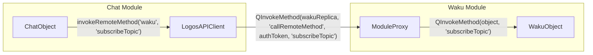

# Logos C++ SDK Specification

## Table of Contents

- [1. Overview and Goals](#1-overview-and-goals)
- [2. Architecture](#2-architecture)
  - [2.1 High-level Structure](#21-high-level-structure)
  - [2.2 SDK Components](#22-sdk-components)
  - [2.3 Code Generator](#23-code-generator)
- [3. API Description](#3-api-description)
  - [3.1.0 Basic Interaction](#310-basic-interaction)
  - [3.1.1 LogosAPI](#311-logosapi)
  - [3.1.2 LogosAPIProvider](#312-logosapiprovider)
    - [3.1.2.1 ModuleProxy (internal)](#3121-moduleproxy-internal)
  - [3.1.3 LogosAPIClient](#313-logosapiclient)
    - [3.1.3.1 LogosAPIConsumer (internal)](#3131-logosapiconsumer-internal)
  - [3.1.4 Generated C++ wrappers (logos_sdk)](#314-generated-c-wrappers-logos_sdk)
  - [3.2 TokenManager](#32-tokenmanager)
  - [3.3 ModuleProxy](#33-moduleproxy)
  - [3.4 Generated Wrappers](#34-generated-wrappers)
- [4. Implementation](#4-implementation)
  - [4.1 SDK Structure](#41-sdk-structure)
  - [4.2 Build System](#42-build-system)
  - [4.3 Code Generator Implementation](#43-code-generator-implementation)
  - [4.4 Generator Outputs and Integration](#44-generator-outputs-and-integration)
- [5. Usage](#5-usage)
  - [5.1 Basic SDK Usage](#51-basic-sdk-usage)
  - [5.2 Generated Wrappers](#52-generated-wrappers)
  - [5.3 Using the Code Generator](#53-using-the-code-generator)

## 1. Overview and Goals

The Logos C++ SDK (`logos-cpp-sdk`) provides a client-side library and code generation tools for building Logos modules and applications. It wraps and abstracts Qt Remote Objects and token management, enabling modules to register themselves and call other modules without dealing with sockets or the remote registry directly. The SDK also provides functionality for code generation.

### Purpose

The SDK abstracts away the complexity of:
- Inter-process communication via Qt Remote Objects
- Authentication token management
- Remote method invocation
- Event subscription and handling
- Code generation for type-safe module wrappers

### Main Repository Components

| Component | Purpose |
|-----------|---------|
| `cpp-generator` | Code generator that creates type-safe C++ wrappers for Logos modules |
| `cpp`  | Client-side SDK that wraps RPC functionality. Modules link against this SDK to call the core and other modules |
| Headers (`include/`) | Public API headers for SDK classes and generated wrappers |

### Other Repository Components

| Component | Purpose |
|-----------|---------|
| `nix/` | Nix build scripts |

## 2. Architecture

### 2.1 High-level Structure

At a high level, the C++ SDK fits into the Logos ecosystem as follows:

**Logos Core** – The core library manages module lifecycle and provides the remote object registry. The SDK connects to this registry to enable inter-module communication.

**Modules** – Modules use the SDK to:
- Register themselves for remote access (via `LogosAPIProvider`)
- Call other modules (via `LogosAPIClient`)
- Handle authentication tokens (via `TokenManager`)
- Subscribe to events from other modules
- C++ code generation for a simplified API

### 2.2 SDK Components

The SDK consists of several key classes:

1. **LogosAPI**: Entry point for modules, manages providers and clients
2. **LogosAPIProvider**: Exposes modules for remote access
3. **LogosAPIClient**: Calls remote modules
4. **LogosAPIConsumer**: Low-level consumer for remote objects
5. **TokenManager**: Manages authentication tokens
6. **ModuleProxy**: Wraps modules for secure remote access

### 2.3 Code Generator

The code generator (`logos-cpp-generator`) is a build-time tool that:

- Loads module plugins using `QPluginLoader`
- Introspects module interfaces using Qt's meta-object system
- Generates type-safe C++ wrapper classes
- Creates umbrella headers that aggregate all module wrappers

## 3. API Description


The C++ SDK (logos-cpp-sdk/cpp) wraps Qt Remote Objects and token management so that modules can register themselves and call other modules without dealing with sockets or the remote registry. The SDK exposes `LogosAPI` that owns a provider (`LogosAPIProvider`) and a cache of clients (`LogosAPIClient`) for different target modules. Internally it relies on a TokenManager to authenticate remote calls. The SDK is asynchronous: calls return immediately and results are delivered via callbacks/signals.

### 3.1.0 Basic Interaction

When calling a method from another module, from the Developer perspective they simply do a call such as:

```c++
bool response = logosAPI->getClient("waku")->invokeRemoteMethod('waku', 'subscribeTopic');
```

or using the code generation functionality
```c++
bool response = logos.waku.subscribeTopic();
```

However under the hood the API abstracts things. In this case the call gets re-routed with the appropriate token and goes to a ModuleProxy object that wraps the actual Object. The ModuleProxy validates the call before forwarding it to the object method.



- `ModuleProxy` is exposed with `QRemoteObjectRegistryHost`
- The call between `LogosAPIClient` and `ModuleProxy` is made using `QRemoteObjectNode`

### 3.1.1 LogosAPI

`LogosAPI` is the entry point for modules and applications. It encapsulates a single provider and a cache of clients and exposes methods to obtain these. A module creates one `LogosAPI` instance during initialisation and passes its own name to it. Internally the constructor constructs a new `LogosAPIProvider` and retrieves a reference to the singleton `TokenManager`. A `QHash` caches `LogosAPIClient` instances keyed by target module so repeated calls reuse the same client.

**Responsibilities**:
- Initialise and own a `LogosAPIProvider` and a `TokenManager`
- Create and cache `LogosAPIClient` objects for calling other modules
- Provide access to the provider and token manager through getters

`LogosAPI` hides the details of registry hosts and consumer connections. Module writers obtain a client via `getClient()` and then call remote methods through that client. They never deal directly with sockets or tokens; the API attaches tokens automatically on calls.

| Method                                                                    | Purpose                                                                                                                     |
| ------------------------------------------------------------------------- | --------------------------------------------------------------------------------------------------------------------------- |
| `explicit LogosAPI(const QString& moduleName, QObject *parent = nullptr)` | Constructs an API for `moduleName` and initialises a provider and token manager.                                            |
| `~LogosAPI()`                                                             | Destructor; child objects (provider, clients) are deleted automatically.                                                    |
| `LogosAPIProvider* getProvider() const`                                   | Returns the provider that modules use to register themselves for remote access.                                             |
| `LogosAPIClient* getClient(const QString& targetModule) const`            | Returns a client for calling `targetModule`.  If a client for that module does not yet exist, it creates one and caches it. |
| `TokenManager* getTokenManager() const`                                   | Returns the token manager used to store and validate authentication tokens.(note: this is meant to be internal but it's exposed for debug purposes)                                                |

### 3.1.2 LogosAPIProvider

`LogosAPIProvider` runs on the module’s side and exposes local objects over the Qt Remote Objects registry. It owns a `QRemoteObjectRegistryHost` and a `ModuleProxy` that wraps the actual module instance. When a module calls `registerObject(name, object)`, the provider optionally calls `object->initLogos(LogosAPI*)` if that method exists, then wraps the object in a `ModuleProxy` and publishes it over the registry. Only one object can be registered per provider; additional attempts return false

**Responsibilities**:

- Create a registry host bound to `local:logos_<moduleName>` when the first object is registered. For example if the module name is `chat` then the registry host will be at `local:logos_chat`.
- Wrap the module in a `ModuleProxy` to enforce token validation and to forward events
- Enable remoting via Qt (enableRemoting) so that other modules can acquire a replica
- Forward event responses to remote subscribers by invoking `eventResponse` on their replica
- Save tokens received from other modules by delegating to the `ModuleProxy`

| Method                                                                                       | Purpose                                                                                                                                                                                                                                                        |
| -------------------------------------------------------------------------------------------- | -------------------------------------------------------------------------------------------------------------------------------------------------------------------------------------------------------------------------------------------------------------- |
| `explicit LogosAPIProvider(const QString& moduleName, QObject *parent = nullptr)`            | Constructs a provider; initialises registry URL `local:logos_<moduleName>`.                                                                                                                                                                                    |
| `~LogosAPIProvider()`                                                                        | Destructor; `QRemoteObjectRegistryHost` and `ModuleProxy` are deleted as children.                                                                                                                                                                             |
| `bool registerObject(const QString& name, QObject *object)`                                  | Registers `object` under `name`.  If the object defines `initLogos(LogosAPI*)` it is invoked first, then the object is wrapped in a `ModuleProxy` and exposed via the registry.  Only one registration per provider is allowed; subsequent calls return false. |
| `QString registryUrl() const`                                                                | Returns the provider’s registry URL.                                                                                                                                                                                                                           |
| `bool saveToken(const QString& fromModuleName, const QString& token)`                        | Persists a token for `fromModuleName` by delegating to the module proxy.                                                                                                                                                                                       |
| `void onEventResponse(QObject *replica, const QString& eventName, const QVariantList& data)` | Emits an event on the subscriber’s replica by invoking its `eventResponse` method.                                                                                                                                                                             |

**Usage Example**

This API is used internally (by the core or logos host) and is not meant to be used by the Developer directly.

```c++
QPluginLoader loader("waku_module.so");
QObject *wakuPlugin = loader.instance()
PluginInterface *baseWakuPlugin = qobject_cast<PluginInterface *>(wakuPlugin)
 
logos_api->getProvider()->registerObject(basePlugin->name(), baseWakuPlugin);
```

This will:
- Call `initLogos` if it exists and pass `LogosAPI` to the module
- Wrap `baseWakuPlugin` with `ModuleProxy`
- Expose the wrapped object with `QRemoteObjectRegistryHost` on `local:logos_<basePlugin->name()>`

### 3.1.2.1 ModuleProxy (internal)

`ModuleProxy` is an internal class used by the provider to expose a module safely. It wraps the real module object and validates every incoming call against the stored authentication tokens. Each proxy keeps a map of tokens keyed by module name.

Modules never instantiate `ModuleProxy` directly; it is created by the provider and published through Qt Remote Objects. Remote callers interact with it implicitly via `LogosAPIClient` and `LogosAPIConsumer`.

**Responsibilities**:
- Validate the authentication token on every remote call. In `callRemoteMethod()` the proxy checks that a non‑empty token is provided and verifies it against the `TokenManager`. Calls with invalid or missing tokens return an empty `QVariant`.
- Dispatch method calls to the underlying module using Qt’s meta‑object system. The proxy locates the requested method by name and argument count, supports up to five arguments, and handles various return types including `void`, `bool`, `int`, `QString`, `QVariant`, `QJsonArray` and `QStringList`
- Introspect the wrapped module’s API via `getPluginMethods()`, returning a `QJsonArray` describing each method (name, signature, return type, parameters)
- Provide an `eventResponse` signal that the provider emits when events are forwarded to subscribers
- Store tokens issued by other modules via `saveToken(fromModuleName, token)`
- Allow a module or consumer to inform another module of a token via `informModuleToken(authToken, moduleName, token)`

| Method                                                                                                          | Purpose                                                                                                                             |
| --------------------------------------------------------------------------------------------------------------- | ----------------------------------------------------------------------------------------------------------------------------------- |
| `explicit ModuleProxy(QObject* module, QObject *parent = nullptr)`                                              | Wraps `module` for remote access.                                                                                                   |
| `QVariant callRemoteMethod(const QString& authToken, const QString& methodName, const QVariantList& args = {})` | Validates `authToken`, locates `methodName` on the module and invokes it.  Supports up to five arguments and multiple return types. This will forward the request to the wrapped object. |
| `bool informModuleToken(const QString& authToken, const QString& moduleName, const QString& token)`             | Stores `token` for `moduleName` in the global `TokenManager`. This is used by the core and capability module to let this module know that another module will communicate using a certain token,=.                                                                       |
| `QJsonArray getPluginMethods()`                                                                                 | Enumerates the wrapped module’s methods using Qt meta‑object introspection and returns a JSON array with signatures and parameters. |
| `eventResponse(QString eventName, QVariantList data)` (signal)                                                  | Emitted when the proxy forwards an event to subscribers.                                                                            |

Example: Listing methods of a module (from a consumer)

```c++
// Acquire the module's proxy (replica)
QObject* walletObj = api.getClient("wallet_module")->requestObject("wallet_module");

// Invoke the introspection method exposed by ModuleProxy
QRemoteObjectPendingCall pending;
QMetaObject::invokeMethod(walletObj, "getPluginMethods", Qt::DirectConnection,
                          Q_RETURN_ARG(QRemoteObjectPendingCall, pending));
pending.waitForFinished(20000);
QJsonArray methods = pending.returnValue().toJsonArray();
```

### 3.1.3 LogosAPIClient

`LogosAPIClient` provides a high‑level, asynchronous interface for invoking methods on remote modules and subscribing to events. Each client is bound to a single target module and holds a `LogosAPIConsumer` to manage the underlying connection. The constructor takes the name of the module to talk to, the origin module name and a `TokenManager` pointer

`LogosAPIClient` should be used by modules to perform calls and event subscriptions. It hides the details of connecting, reconnection, token lookup, argument packaging and result deserialization.

**Responsibilities**:
- Manage the connection to the remote registry and acquire remote object replicas via the consumer
- Retrieve and attach authentication tokens for calls. Before every call, the client looks up the token for the target module and passes it to the consumer
- Provide convenience overloads of `invokeRemoteMethod()`` for 0–5 arguments, returning a `QVariant` result
- Register event listeners with optional callbacks and route event responses back to the origin module
- Forward token information to another module by calling `informModuleToken()` on the consumer

| Method                                                                                                                                                                                                                                          | Purpose                                                                                                                                                                      |
| ----------------------------------------------------------------------------------------------------------------------------------------------------------------------------------------------------------------------------------------------- | ---------------------------------------------------------------------------------------------------------------------------------------------------------------------------- |
| `explicit LogosAPIClient(const QString& moduleToTalkTo, const QString& originModule, TokenManager* tokenManager, QObject *parent = nullptr)`                                                                                                    | Constructs a client bound to `moduleToTalkTo`; internally creates a `LogosAPIConsumer`.                                                                                      |
| `QObject* requestObject(const QString& objectName, int timeoutMs = 20000)`                                                                                                                                                                      | Acquires a remote object replica by name through the consumer.                                                                                                               |
| `bool isConnected() const`                                                                                                                                                                                                                      | Returns whether the client’s consumer is connected to the registry.                                                                                                          |
| `QString registryUrl() const`                                                                                                                                                                                                                   | Returns the URL of the registry the client is connected to.                                                                                                                  |
| `bool reconnect()`                                                                                                                                                                                                                              | Reconnects to the registry by creating a new consumer node.                                                                                                                  |
| `QVariant invokeRemoteMethod(const QString& objectName, const QString& methodName, const QVariantList& args = {}, int timeoutMs = 20000)` and overloads for 1–5 arguments                                                                       | Calls `methodName` on `objectName` asynchronously.  Looks up the caller’s auth token and passes it to the consumer.  Returns the result or an invalid `QVariant` on failure. |
| `void onEvent(QObject* originObject, QObject* destinationObject, const QString& eventName, std::function<void(const QString&, const QVariantList&)> callback)`                                                                                  | Subscribes to `eventName` emitted by `originObject` and invokes `callback` when triggered.                                                                                   |
| `void onEvent(QObject* originObject, QObject* destinationObject, const QString& eventName)`                                                                                                                                                     | Subscribes to an event by connecting `originObject`’s `eventResponse` signal to `destinationObject`’s `onEventResponse` slot.                                                |
| `void onEventResponse(QObject* replica, const QString& eventName, const QVariantList& data)`                                                                                                                                                    | Internal helper; emits `eventResponse` on the replica when events arrive.                                                                                                    |
| `bool informModuleToken(const QString& authToken, const QString& moduleName, const QString& token)` and `bool informModuleToken_module(const QString& authToken, const QString& originModule, const QString& moduleName, const QString& token)` | Forwards a token to another module via the consumer.                                                                                                                         |
| `TokenManager* getTokenManager() const`                                                                                                                                                                                                         | Returns the token manager used by this client.                                                                                                                               |
| `QString getToken(const QString& moduleName)`                                                                                                                                                                                                   | Helper that retrieves the token for `moduleName` from the token manager.                                                                                                     |

**Usage**

This is the most common API that a module developer will use:

Calling a remote method:
```c++
logosAPI->getClient("chat")->invokeRemoteMethod("chat", "joinChannel", currentChannel);
```

Calling a remote method with multiple parameters:
```c++
logosAPI->getClient("chat")->invokeRemoteMethod("chat", "sendMessage", currentChannel, username, message)
```

note: Internally the API will take care of any token negotiation and permissions needed (see Sequence Diagram section)

Listening to Events from another object:

```c++
QObject *chatObject = m_logosAPI->getClient("chat")->requestObject("chat");

m_logosAPI->getClient("chat")->onEvent(chatObject, this, "chatMessage", [this](const QString &eventName, const QVariantList &data) {
          handleWakuMessage(data[0].toString().toStdString(), data[1].toString().toStdString(), data[2].toString().toStdString());
});
```

Listening to events from another module via the generated helpers:

```c++
LogosModules logos(m_logosAPI);

logos.chat.on("chatMessage", [this](const QVariantList& data) {
    handleWakuMessage(data.value(0).toString().toStdString(),
                      data.value(1).toString().toStdString(),
                      data.value(2).toString().toStdString());
});
```

Triggering an event:

```c++
QVariantList data;
data << timestamp << nick << message;

logosAPI->getClient("chat")->onEventResponse(this, "chatMessage", data);
```

Triggering an event with the generated helpers:

```c++
logos.chat.setEventSource(this);

QVariantList data;
data << timestamp << nick << message;

logos.chat.trigger("chatMessage", data);
```

### 3.1.3.1 LogosAPIConsumer (internal)

`LogosAPIConsumer` is the low‑level component used by `LogosAPIClient`. It manages the connection to the registry, acquires remote object replicas and invokes methods via Qt Remote Objects. It also handles event subscription and token propagation. The constructor stores the registry URL `local:logos_<targetModule>` and attempts to connect immediately. A `LogosAPIClient` will have multiple `LogosAPIConsumer` instances.

`LogosAPIConsumer` should not be used directly by most developers; it is an implementation detail of `LogosAPIClient`. It provides fine‑grained control over remote calls and event handling and encapsulates the complexity of `QRemoteObjectNode`, replicas and pending calls.

**Responsibilities**:
- Manage a `QRemoteObjectNode` connection to the registry and reconnect when needed
- Acquire dynamic replicas of remote objects and wait for them to be ready within a timeout
- Invoke remote methods either via a `ModuleProxy` (if the replica is a proxy) or directly on the remote object using Qt’s `invokeMethod` and `QRemoteObjectPendingCall`
- Register event listeners: store callbacks per event and connect to the remote object’s `eventResponse` signal. When events arrive, `invokeCallback()`` iterates through all registered callbacks and invokes them
- Register simple event subscriptions by connecting the remote `eventResponse` signal directly to a destination slot
- Forward tokens to another module through a remote `informModuleToken` call on the module’s proxy and support informing tokens for modules loaded by the origin module

| Method                                                                                                                                                              | Purpose                                                                                                                                                                                                                              |
| ------------------------------------------------------------------------------------------------------------------------------------------------------------------- | ------------------------------------------------------------------------------------------------------------------------------------------------------------------------------------------------------------------------------------ |
| `explicit LogosAPIConsumer(const QString& moduleToTalkTo, const QString& originModule, TokenManager* tokenManager, QObject *parent = nullptr)`                      | Constructs the consumer, sets the registry URL and immediately calls `connectToRegistry()`.                                                                                                                                          |
| `~LogosAPIConsumer()`                                                                                                                                               | Destructor; disconnects stored connections and clears callbacks.                                                                                                                                                                     |
| `QObject* requestObject(const QString& objectName, int timeoutMs = 20000)`                                                                                          | Acquires a remote object replica and waits for it to be ready.  Returns `nullptr` on failure.                                                                                                                                        |
| `bool isConnected() const`                                                                                                                                          | Reports whether the consumer is connected to the registry.                                                                                                                                                                           |
| `QString registryUrl() const`                                                                                                                                       | Returns the registry URL.                                                                                                                                                                                                            |
| `bool reconnect()`                                                                                                                                                  | Reconnects by creating a new `QRemoteObjectNode` and calling `connectToRegistry()`.                                                                                                                                                  |
| `bool connectToRegistry()` (private)                                                                                                                                | Connects to the registry URL using `QRemoteObjectNode::connectToNode` and updates `m_connected`.                                                                                                                                     |
| `QVariant invokeRemoteMethod(const QString& authToken, const QString& objectName, const QString& methodName, const QVariantList& args = {}, int timeoutMs = 20000)` | Invokes a remote method.  If the replica is a `ModuleProxy`, calls its `callRemoteMethod()` with the provided token.  Otherwise it invokes `callRemoteMethod` on the replica and waits for the `QRemoteObjectPendingCall` to finish. |
| `void onEvent(QObject* originObject, QObject* destinationObject, const QString& eventName, std::function<void(const QString&, const QVariantList&)> callback)`      | Registers a callback for `eventName` by storing it and ensuring the connection to the origin object’s `eventResponse` signal.                                                                                                        |
| `void onEvent(QObject* originObject, QObject* destinationObject, const QString& eventName)`                                                                         | Registers an event listener without a callback by connecting `originObject->eventResponse` to the `destinationObject->onEventResponse` slot.                                                                                         |
| `void invokeCallback(const QString& eventName, const QVariantList& data)` (slot)                                                                                    | Invokes all callbacks registered for `eventName`.                                                                                                                                                                                    |
| `bool informModuleToken(const QString& authToken, const QString& moduleName, const QString& token)`                                                                 | Informs the capability module’s proxy about a token for `moduleName`.                                                                                                                                                                |
| `bool informModuleToken_module(const QString& authToken, const QString& originModule, const QString& moduleName, const QString& token)`                             | Informs a module loaded by `originModule` about a token via that module’s proxy.                                                                                                                                                     |

### 3.1.4 Generated C++ wrappers (logos_sdk)

To simplify calling methods across modules with proper C++ types, a generator produces typed wrappers into `logos-cpp-sdk/cpp/generated/` and an umbrella pair `logos_sdk.h`/`logos_sdk.cpp`. The umbrella aggregates one wrapper class per module and exposes them via a convenience struct `LogosModules`.

Usage:

```c++
#include "logos_sdk.h"

LogosAPI* api = new LogosAPI("core", this);
LogosModules logos(api);

bool ok = logos.chat.initialize();
logos.chat.joinChannel(currentChannel);
logos.chat.sendMessage(currentChannel, username, message);
logos.chat.on("chatMessage", [](const QVariantList& data) {
    qDebug() << "timestamp:" << data.value(0).toString();
});
logos.chat.setEventSource(this);
logos.chat.trigger("chatMessage", QVariantList{QDateTime::currentDateTime().toString(), "nick", "hello"});
```

`setEventSource()` stores the QObject that actually declares the `eventResponse(QString, QVariantList)` signal—typically the plugin instance itself. The wrapper uses that cached pointer when you call the shorthand `trigger(eventName, data)` so it can emit the signal on the correct sender. If you skip `setEventSource()`, use the explicit overload `trigger(eventName, QObject* source, ...)` to provide the emitting object each time.

Build integration (consumers of wrappers):
- Compile the umbrella source once per binary to avoid duplicate symbols: add `logos-cpp-sdk/cpp/generated/logos_sdk.cpp` to your target sources.
- Add `logos-cpp-sdk/cpp/generated` to your include paths.
- Wrappers are generated during the modules/app build by a custom step; see below.

CMake example (abbreviated):

```cmake
set(GENERATED_LOGOS_SDK_CPP ${CMAKE_CURRENT_SOURCE_DIR}/../../logos-cpp-sdk/cpp/generated/logos_sdk.cpp)
set_source_files_properties(${GENERATED_LOGOS_SDK_CPP} PROPERTIES GENERATED TRUE)
target_sources(<your_target> PRIVATE ${GENERATED_LOGOS_SDK_CPP})
target_include_directories(<your_target> PRIVATE ${CMAKE_CURRENT_SOURCE_DIR}/../../logos-cpp-sdk/cpp/generated)
```

Generator:
- Binary: `build/cpp-generator/bin/logos-cpp-generator` (built via `logos-cpp-sdk/cpp-generator/compile.sh`).
- Typical invocation from CMake custom targets:
  - `logos-cpp-generator --metadata <path>/metadata.json --module-dir <path>/modules/build/modules`
- Outputs for each dependency module: `<module>_api.h/.cpp`, plus umbrella `logos_sdk.h/.cpp`.
- Always emits `core_manager_api.h/.cpp` and wires `CoreManager` into the umbrella even if the metadata does not list `core_manager`.  The core manager plug‑in is built into the core process and therefore cannot be introspected via `QPluginLoader`; generating it unconditionally guarantees SDK consumers can manage the core (initialise, enumerate plug‑ins, load/unload, etc.) without hand‑written bindings.
- Return types are mapped appropriately (e.g., `bool`, `int`, `double`, `float`, `QString`, `QStringList`, `QJsonArray`, or `QVariant`).

CLI flags and behavior:
- **--metadata <file>**: Path to a module's `metadata.json`. The generator parses the `dependencies` array to determine which modules to emit wrappers for.
- **--module-dir <dir>**: Directory containing built module plugins (e.g., `chat_plugin.so/.dylib`, `waku_module_plugin.*`). For each dependency, the generator loads the corresponding plugin to introspect its interface and generate wrappers.
- If only a plugin path is provided (without `--metadata`), the generator produces wrappers for that single plugin.
- Artifacts are written under the repository root’s `logos-cpp-sdk/cpp/generated` directory and include: one `<module>_api.h/.cpp` per dependency and the umbrella `logos_sdk.h/.cpp` that aggregates them into `LogosModules`.

What it does under the hood:
- Loads each dependency plugin via `QPluginLoader`, creates an instance and enumerates its invokable methods using Qt meta‑object reflection.
- For each method, emits a type‑safe C++ wrapper function that marshals arguments and converts results from `QVariant` to the expected C++ types.
- Regenerates an umbrella header/source to include all generated module wrappers and expose a convenience aggregator `LogosModules` with members like `logos.chat` and `logos.core_manager`.

How code generation works (step‑by‑step):
1. Input resolution
   - If `--metadata` is provided, the generator parses the JSON and reads the `dependencies` array.
   - It combines each dependency name with a platform suffix (e.g., `_plugin.dylib` on macOS, `.so` on Linux, `.dll` on Windows) and looks for those plugin files under `--module-dir`.
   - If only a single plugin path is provided (no `--metadata`), it generates wrappers for that one plugin.
2. Plugin loading and introspection
   - Each target plugin is loaded with `QPluginLoader` and instantiated.
   - The generator walks the plugin instance’s Qt meta‑object (`QMetaObject`) to find invokable methods, capturing name, return type and parameters. This produces a method list the generator uses as its source of truth.
3. Header/source emission per module
   - The module name is converted to PascalCase for the wrapper class name (e.g., `chat` → `Chat`).
   - A header `<module>_api.h` declares a wrapper class with the typed method wrappers **and** convenience helpers for events (`on(...)`, `setEventSource(...)`, `trigger(...)`).
   - A source `<module>_api.cpp` implements each method by:
     - Packaging arguments into a `QVariantList` in order.
     - Invoking the remote method via the shared `LogosAPI`/client under the hood.
     - Converting the `QVariant` result to the declared return type using safe conversions (`toBool`, `toInt`, `toDouble`, `toFloat`, `toString`, `toStringList`, `qvariant_cast<QJsonArray>`), or returning the `QVariant` as‑is for generic cases.
4. Umbrella composition
   - `logos_sdk.h` includes all generated `*_api.h` files and defines a convenience aggregator:
     - `struct LogosModules { explicit LogosModules(LogosAPI* api); <Wrapper> <module_name>; ... }`.
   - `logos_sdk.cpp` includes all generated `*_api.cpp` sources.
   - Consumers compile `logos_sdk.cpp` exactly once per binary and include `logos_sdk.h` to access `logos.<module>.<method>(...)` across modules.
5. Build integration and idempotency
   - CMake custom targets call the generator before compiling modules/apps so `logos-cpp-sdk/cpp/generated` is always up‑to‑date.
   - The `scripts/clean.sh` script deletes generated files (`*_api.h/.cpp`, `logos_sdk.h/.cpp`) while leaving the directory in place.
6. Scope and limitations
   - Wrapper method signatures use Qt types (`QString`, `QStringList`, `QJsonArray`, etc.). For unsupported/complex types, the return falls back to `QVariant`.
   - Event helpers ride on top of `LogosAPIClient::onEvent(...)`/`onEventResponse(...)`; call `setEventSource()` once before emitting events from a module.

### 3.2 TokenManager

`TokenManager` is a thread-safe singleton that manages authentication tokens for inter-module communication.

#### Class Definition

```c++
class TokenManager : public QObject {
public:
    static TokenManager* instance();
    
    void saveToken(const QString& key, const QString& token);
    QString getToken(const QString& key) const;
    bool hasToken(const QString& key) const;
    void removeToken(const QString& key);
    QList<QString> getTokenKeys() const;
};
```

#### Methods

| Method | Purpose |
|--------|---------|
| `instance() → TokenManager*` | Returns the singleton instance |
| `saveToken(key, token)` | Stores a token with the given key |
| `getToken(key) → QString` | Retrieves a token by key |
| `hasToken(key) → bool` | Checks if a token exists for the key |
| `removeToken(key)` | Removes a token |
| `getTokenKeys() → QList<QString>` | Returns all token keys |

**Responsibilities**:
- Store capability-issued tokens keyed by module name and provide thread-safe access.
- Support both module-level tokens and special tokens for core/core_manager/capability flows.

### 3.3 ModuleProxy

`ModuleProxy` is an internal class used by the provider to expose a module safely. It wraps the real module object and validates every incoming call against stored authentication tokens.

#### Class Definition

```c++
class ModuleProxy : public QObject {
public:
    explicit ModuleProxy(QObject* module, QObject *parent = nullptr);
    
    QVariant callRemoteMethod(const QString& authToken, const QString& methodName, 
                             const QVariantList& args = {});
    bool informModuleToken(const QString& authToken, const QString& moduleName, const QString& token);
    QJsonArray getPluginMethods();
    
signals:
    void eventResponse(const QString& eventName, const QVariantList& data);
};
```

#### Methods

| Method | Purpose |
|--------|---------|
| `callRemoteMethod(authToken, methodName, args) → QVariant` | Validates `authToken`, locates `methodName` on the module and invokes it |
| `informModuleToken(authToken, moduleName, token) → bool` | Stores `token` for `moduleName` in the global `TokenManager` |
| `getPluginMethods() → QJsonArray` | Enumerates the wrapped module's methods using Qt meta-object introspection |

**Responsibilities**:
- Enforce token validation on every inbound call (returns invalid `QVariant` on failure).
- Dispatch to the wrapped QObject via Qt meta-object APIs and support introspection via `getPluginMethods()`.
- Provide the `eventResponse` signal used by providers/clients to forward events across process boundaries.

### 3.4 Generated Wrappers

The code generator emits type-safe wrappers per module plus an umbrella (`logos_sdk.h/.cpp`) that aggregates them into a `LogosModules` helper. Generated wrappers provide:

- Typed method calls (no string-based method names)
- Automatic argument marshalling and `QVariant` conversions
- Event subscription helpers (`on(...)`) and a `trigger(...)` helper for emitting events
- `setEventSource(QObject*)` to cache the QObject that actually emits `eventResponse` when using `trigger(...)`

#### Example Generated Wrapper

```c++
class Chat {
public:
    explicit Chat(LogosAPI* api);
    
    bool initialize();
    bool joinChannel(const QString& channelName);
    void sendMessage(const QString& channelName, const QString& username, const QString& message);
    bool retrieveHistory(const QString& channelName);
    
    void on(const QString& eventName, std::function<void(const QVariantList&)> callback);
    void setEventSource(QObject* source);
    void trigger(const QString& eventName, const QVariantList& data);
};
```

## 4. Implementation

### 4.1 SDK Structure

The SDK has the following directory structure:

```
logos-cpp-sdk/
├── cpp/                          # SDK library source
│   ├── logos_api.h/cpp          # LogosAPI class
│   ├── logos_api_provider.h/cpp  # Provider implementation
│   ├── logos_api_client.h/cpp    # Client implementation
│   ├── logos_api_consumer.h/cpp  # Consumer implementation
│   ├── token_manager.h/cpp       # Token manager
│   ├── module_proxy.h/cpp        # Module proxy
│   └── CMakeLists.txt           # SDK build config
├── cpp-generator/                # Code generator source
│   ├── main.cpp                  # Generator entry point
│   └── CMakeLists.txt           # Generator build config
├── core/                         # Core interface headers
│   └── interface.h               # PluginInterface definition
├── nix/                          # Nix build configuration
│   ├── default.nix               # Common configuration
│   ├── bin.nix                   # Generator binary build
│   ├── lib.nix                   # SDK library build
│   └── include.nix               # Header installation
└── docs/
    └── docs.md                  # This document
```

### 4.2 Build System

The SDK supports two build systems: Nix (recommended) and CMake.

#### Nix Build System

The SDK includes a Nix flake for reproducible builds:

- `nix/default.nix`: Common configuration (dependencies, flags, metadata)
- `nix/bin.nix`: Generator binary compilation
- `nix/lib.nix`: SDK library compilation
- `nix/include.nix`: Header installation

**Build the SDK:**
```bash
nix build
```

This creates a `result` symlink with:
```
result/
├── bin/
│   └── logos-cpp-generator      # Code generator binary
├── lib/
│   └── liblogos_sdk.a            # Static SDK library
└── include/
    ├── core/
    │   └── interface.h          # Core interface
    └── cpp/
        ├── logos_api.h
        ├── logos_api_client.h
        ├── logos_api_provider.h
        ├── logos_api_consumer.h
        ├── token_manager.h
        └── module_proxy.h
```

**Build individual components:**
```bash
# Build only the generator
nix build '.#logos-cpp-bin'

# Build only the library
nix build '.#logos-cpp-lib'

# Build only the headers
nix build '.#logos-cpp-include'
```

#### CMake Build Configuration

**Building the SDK library:**
```bash
cd cpp
./compile.sh
```

**Building the code generator:**
```bash
cd cpp-generator
./compile.sh
```

### 4.3 Code Generator Implementation

The code generator (`logos-cpp-generator`) works as follows:

1. **Plugin Loading**: Loads module plugins using `QPluginLoader`
2. **Introspection**: Uses Qt's meta-object system to enumerate methods
3. **Code Generation**: Generates C++ wrapper classes with type-safe methods
4. **Umbrella Creation**: Creates `logos_sdk.h/cpp` that aggregates all wrappers

**Generator Options:**

- `--metadata <file>`: Path to module metadata.json
- `--module-dir <dir>`: Directory containing built module plugins
- `--output-dir <dir>`: Output directory for generated files
- `--module-only`: Generate only module wrappers (no core manager or umbrella)
- `--general-only`: Generate only core manager and umbrella (reference existing modules)

### 4.4 Generator Outputs and Integration

Outputs live under `logos-cpp-sdk/cpp/generated/` by default:

- One `<module>_api.h/.cpp` per dependency or single plugin input
- Umbrella `logos_sdk.h/.cpp` that aggregates all wrappers into `struct LogosModules`
- `core_manager` wrapper is always emitted so consumers can manage the core via RPC even though the core manager cannot be introspected at build time

Build integration tips:
- Compile `logos_sdk.cpp` exactly once per binary to avoid duplicate symbols; include `logos_sdk.h` wherever wrappers are needed.
- Add `logos-cpp-sdk/cpp/generated` to include paths.
- Typical CMake pattern marks `logos_sdk.cpp` as `GENERATED` and wires a custom target to run `logos-cpp-generator` before compile.

## 5. Usage

### 5.1 Basic SDK Usage

**Basic usage in a module:**

```c++
#include "logos_api.h"

// Create LogosAPI instance
LogosAPI* logosAPI = new LogosAPI("my_module", this);

// Register this module for remote access
logosAPI->getProvider()->registerObject("my_module", this);

// Call another module
LogosAPIClient* chatClient = logosAPI->getClient("chat");
QVariant result = chatClient->invokeRemoteMethod("chat", "initialize");
bool success = result.toBool();

// Subscribe to events
QObject* chatObject = chatClient->requestObject("chat");
chatClient->onEvent(chatObject, this, "chatMessage", 
    [](const QString& eventName, const QVariantList& data) {
        // Handle event
    }
);
```

### 5.2 Generated Wrappers

**Using generated wrappers:**

```c++
#include "logos_sdk.h"

LogosAPI* api = new LogosAPI("app", this);
LogosModules logos(api);

// Type-safe method calls
bool ok = logos.chat.initialize();
logos.chat.joinChannel("general");
logos.chat.sendMessage("general", "alice", "Hello!");

// Event subscription
logos.chat.on("chatMessage", [](const QVariantList& data) {
    QString timestamp = data[0].toString();
    QString username = data[1].toString();
    QString message = data[2].toString();
    // Handle message
});

// Trigger events
logos.chat.setEventSource(this);
logos.chat.trigger("chatMessage", QVariantList{timestamp, username, message});
```

### 5.3 Using the Code Generator

**Generate wrappers for a single plugin:**
```bash
logos-cpp-generator /path/to/chat_plugin.dylib --output-dir ./generated
```

**Generate wrappers from metadata:**
```bash
logos-cpp-generator --metadata metadata.json --module-dir ./modules --output-dir ./generated
```

**Generate only module wrappers:**
```bash
logos-cpp-generator /path/to/plugin.dylib --module-only --output-dir ./generated
```

**Generate umbrella SDK only:**
```bash
logos-cpp-generator --metadata metadata.json --general-only --output-dir ./generated
```
